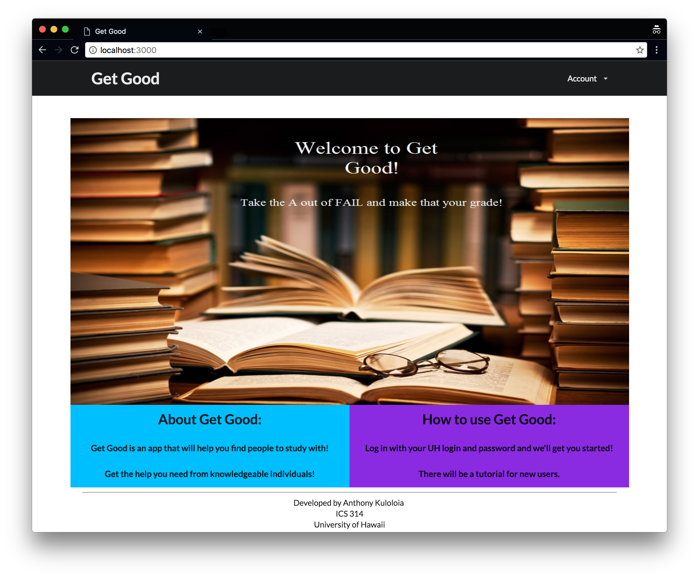
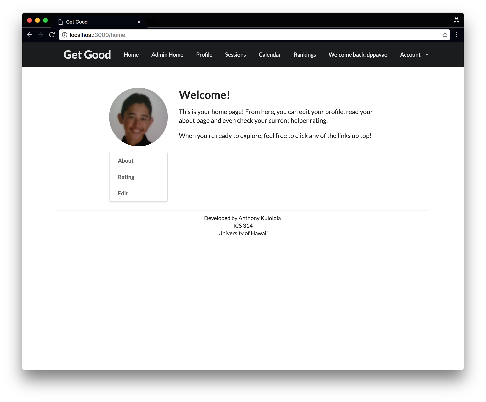
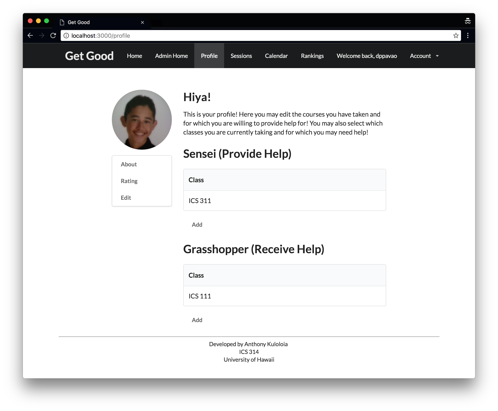
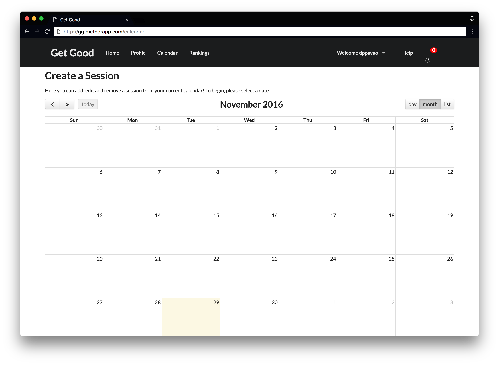
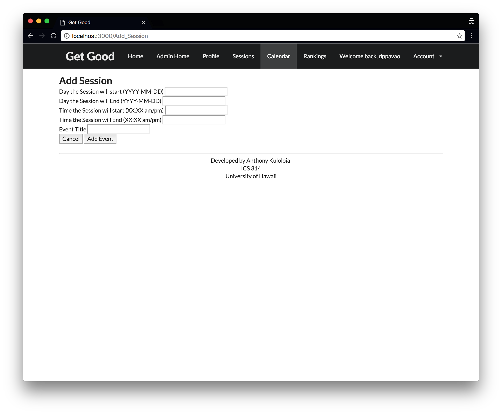
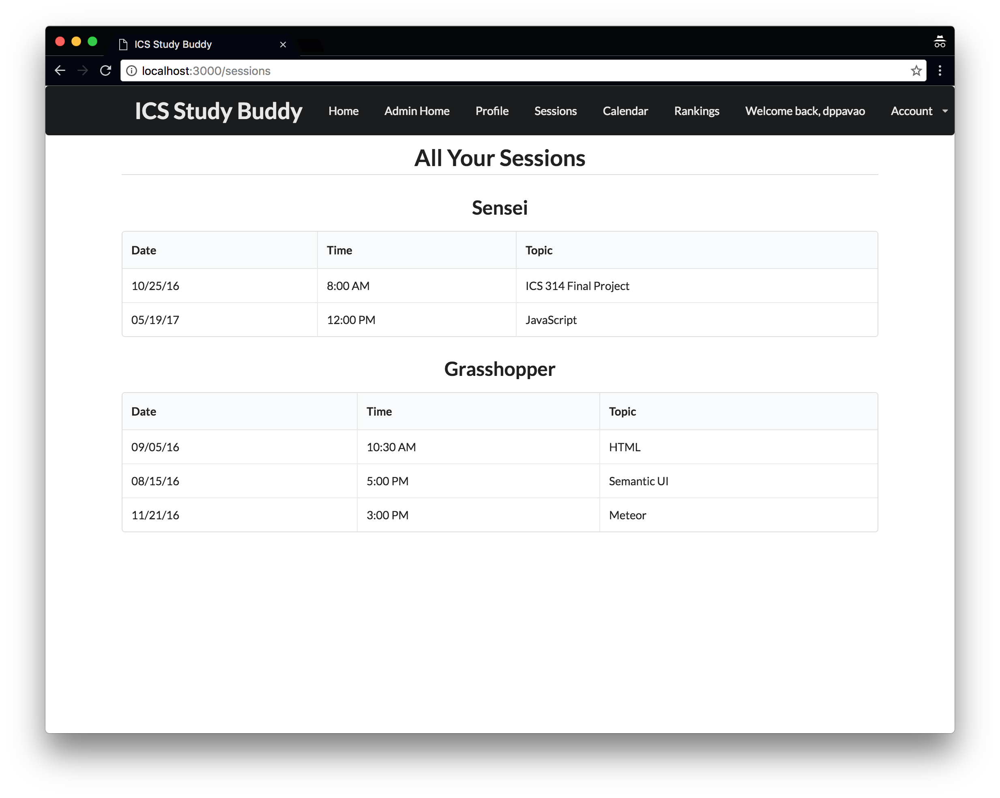
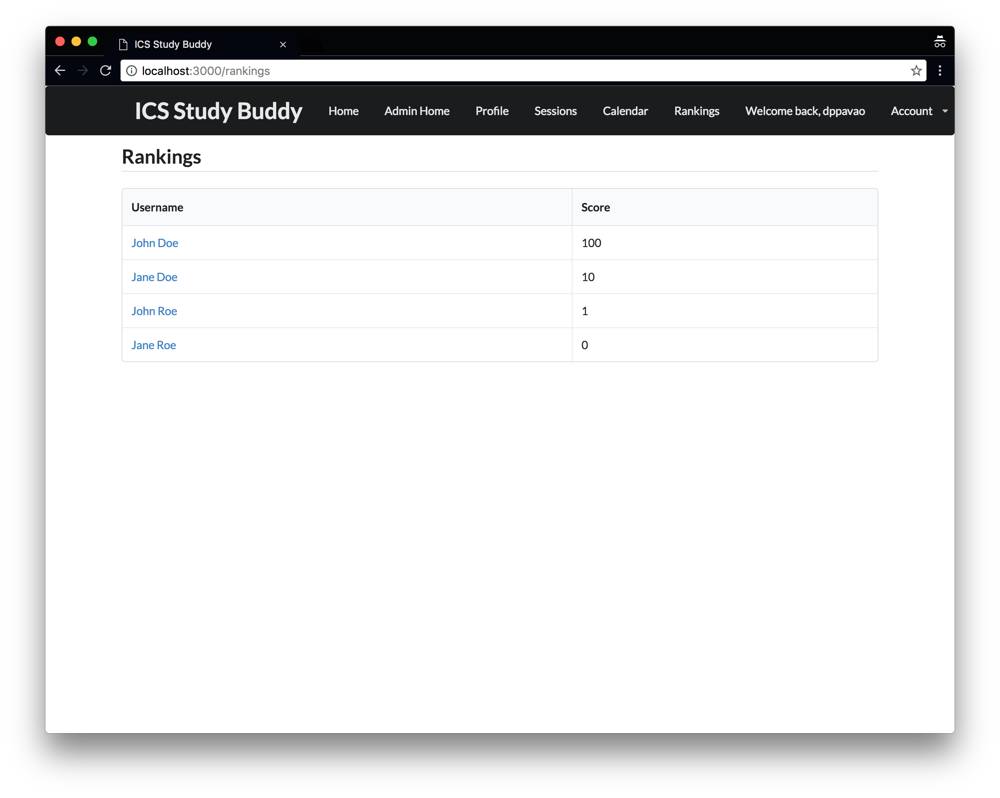
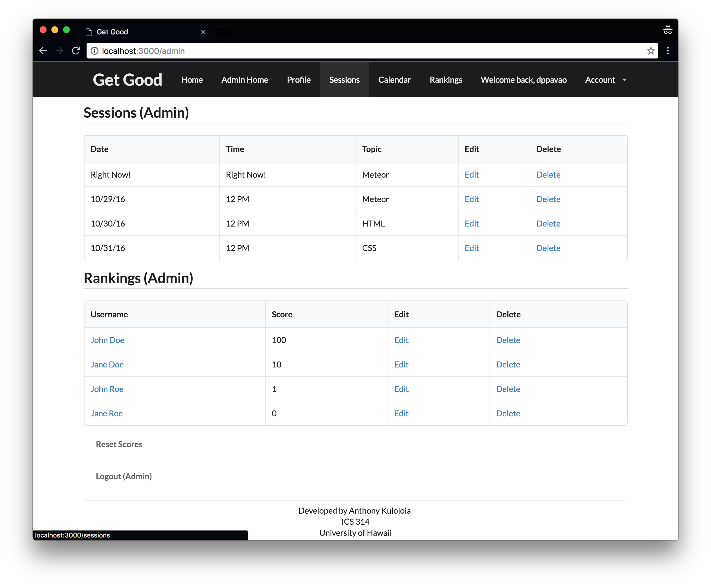

## Milestones
<a href="https://github.com/get-good/gg/projects/1">M1</a>
<a href="https://github.com/get-good/gg/projects/2">M2</a>

## The App
If you're tired of bad grades, you're not the only one. Get Good lets you find others who are struggling just as much as you are. Together, you can find people who are more knowledgeable on the topic and have them help you!

## Installation
This app requires meteor to be installed on your computer. To do so, please see their <a href="https://www.meteor.com/">page</a>.
To install get good, download the .zip file and extract all the files. Then, change your directory to the app directory contained in the extracted contents. From there, type meteor run and you're all set!

## Usage
Here's how to use the app:

Loging in using your UH Email will ask you to agree to the terms of use.

Once agreed, you will be directed to your home page.

View your own profile.

If you want to create a session, head to the calendar page and add an event.

If you want to add an event, you can click a day and you will be redirected to this page.

View all your past and future sessions as a grasshopper or sensei.

View the rankings of all users using the app.

This is what our admin page looks like.

## Development
If you'd like to help with development, here's what you'll need to do:

Download and install <a href="https://www.meteor.com/">meteor</a> on your computer if you haven't already done so.

You'll also need <a href="https://nodejs.org/en/">node.js</a> installed. With meteor and node.js installed, you'll be all set to develop with an IDE of your choice.

## Contact Us
### Developers
- <a href="https://github.com/akuloloia">Anthony Kulololia</a>
- <a href="https://github.com/dankoo">Daniel Koo</a>
- <a href="https://github.com/dylanpavao">Dylan Pavao</a>
- <a href="https://github.com/jchock">Justin Chock</a>
