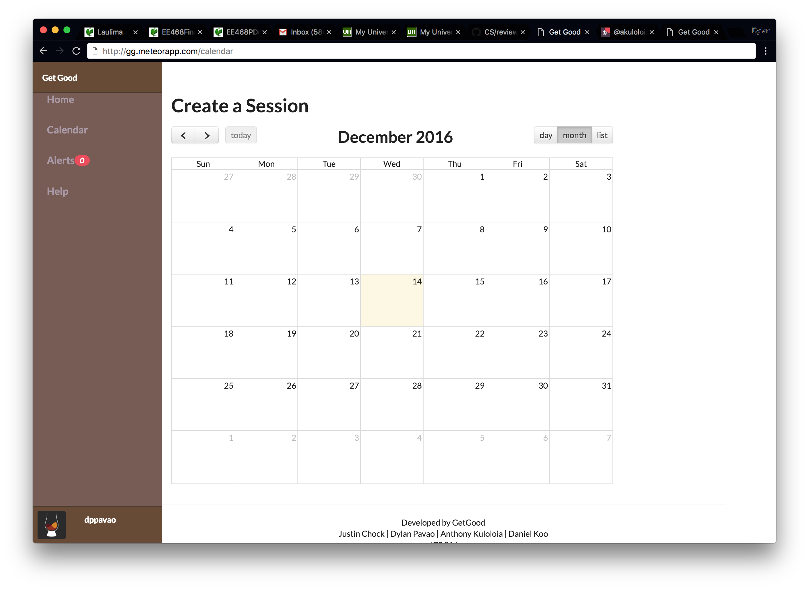
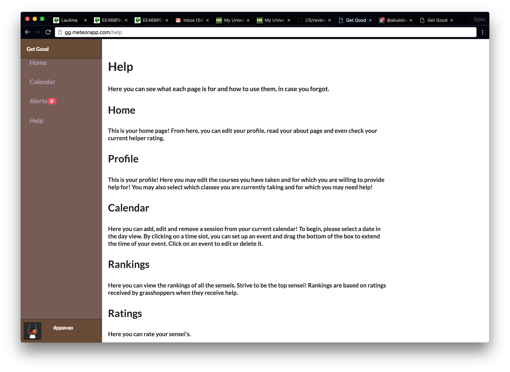

## Get Good!
If you're tired of bad grades, you're not the only one. Get Good lets you find others who are struggling just as much as you are. Together, you can find people who are more knowledgeable on the topic and have them help you!

## User Guide

When first using our app. We prompt you with alerts to make sure you're not lost. If you want these alerts to stop simply check the box and press OK.

Logging in using your UH Email will ask you to agree to the terms of use.

Once agreed, you will be directed to your home page. When first using our app, We prompt you with alerts to make sure you're not lost. If you want these alerts to stop, simply check the box and press OK.

View your own profile.

If you want to create a session, head to the calendar page and add an event.

If you want to add an event, you can click a day and you will be redirected to this page.

View the rankings of all users using the app.

If you need more help, head to our help page.

## Development
If you'd like to help with development, here's what you'll need to do:

Download the .zip file, extract the contents, and copy them to a directory to develop in.

Download and install <a href="https://www.meteor.com/">meteor</a> on your computer if you haven't already done so.

You'll also need <a href="https://nodejs.org/en/">node.js</a> installed.

Navigate into the /app subdirectory within the development directory and type "meteor npm install" in the command line.

With meteor and node.js installed, you'll be all set to develop with an IDE of your choice.

You can run the app locally by typing "meteor --settings ../config/settings.development.json" in the command line

## Milestones
- <a href="https://github.com/get-good/gg/projects/1">Milestone 1</a>
- <a href="https://github.com/get-good/gg/projects/2">Milestone 2</a>
- <a href="https://github.com/get-good/gg/projects/3">Milestone 3</a>

## Contact Us
### Developers
- <a href="https://akuloloia.github.io/">Anthony Kulololia</a>
- <a href="https://dankoo.github.io/">Daniel Koo</a>
- <a href="https://dylanpavao.github.io/">Dylan Pavao</a>
- <a href="https://jchock.github.io/">Justin Chock</a>
